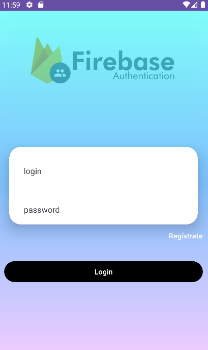
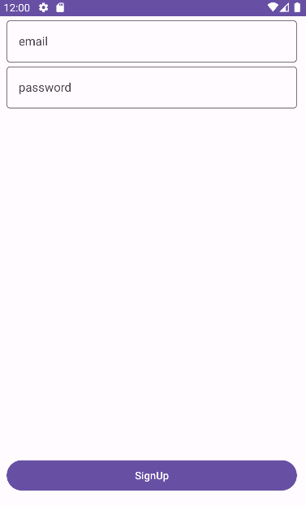

## Registration and login through firebase authentication

*[Firebase](https://firebase.google.com/?hl=es)

### We have the main screen where we can decide whether to log in or register.

### We will also have the other activity to register

### If we give the correct credentials we can access the following screen and exit with logout

